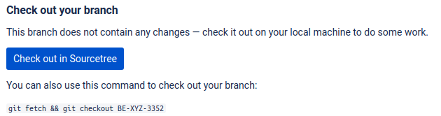

:jira_url: https://www.atlassian.com/software/jira[JIRA] 
:bitbucket_url: https://bitbucket.org/[Bitbucket] 
:atlassian_url: https://www.atlassian.com/[Atlassian Products]

= Bitbucket New Branch

This is just a simple extension/addon/extra for browsers that adds the copy to clipboard action and make the git checkout command when using Bitbucket more readable.

I have come to this ideia, because when using {jira_url} and {bitbucket_url} both {atlassian_url}.

JIRA allow users to open a new branch with it's JIRA ID directly in Bitbucket, but, when the new branch is created, the code for fetch and chechout isnt really visible.

== Result

.Before 
**** 

****

.After 
**** 

****

== Install
Every browser has its way of install extensions/addons, just look for the one you use.

The only thing in common is

* Download this project, or clone it
* Activate "Developer Mode" on the extension page configuration
* Select the folder or the *manifest.json* file

This should be enought to make it work, now go create a new branch in bitbucket :-)

== Tested Successfully

* [*] Google Chrome
* [*] Firefox
* [*] Opera

== Credits
* My coworkers that have tested and are using this tool
* Icon made by Freepik from www.flaticon.com
* The creator of the js lib toast that i use, but dont know who he is

== Licence
link:LICENSE[MIT]